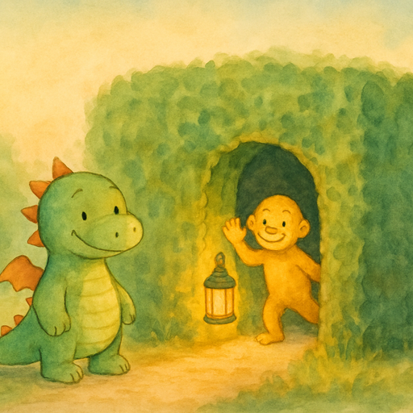
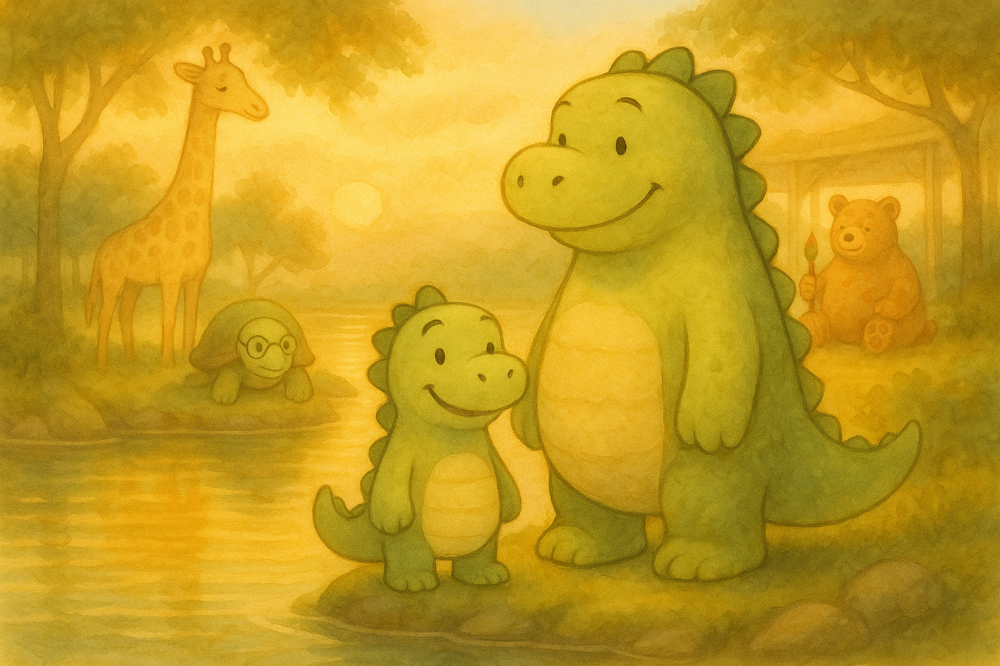

<p align="center">
  
</p>

<h1 align="center">Firlefanz</h1>

<p align="center">
  An interactive storybook app for kids — illustrated, narrated, and ready for bedtime.
</p>

<p align="center">
  <a href="https://firlefanz.li">Live App</a>
</p>

---

**Firlefanz** is a dragon/dinosaur-like character (no specific gender) who lives in a small house in a small village, next to **Papalapapp**. Together they embark on epic journeys — over 7 seas, 7 deserts, 7 mountains, 7 rivers, and 7 forests — to discover fantastical places, make new friends, and return home just in time for bed.

The app presents pre-generated illustrated stories in a kids' book format, complete with audio narration, background music, page-turn animations, and a cozy nightlight nook library. Every story is designed to calm young listeners (ages 3–6) and guide them gently to sleep.

<p align="center">
  
</p>

## Features

- **Nightlight library ("Das Nachtlicht")** — framed 3:2 cover paintings on warm wooden shelves, lit by a soft nightlight glow
- **Open book reader** — desktop shows a two-page spread (illustration left, text right); mobile stacks them vertically
- **Audio narration** — pre-generated TTS with automatic page turning
- **Background music** — a quiet looping instrumental bed per story, ducking under the narration so the voice always leads
- **Night mode** — warm dark palette for bedtime reading, defaults to OS preference
- **Bilingual** — German (base) and English, with easy extensibility to more languages
- **Downloadable PDFs** — each story available as a printable book
- **PWA** — installable on iOS, Android, and desktop; works offline after first visit

## Story Pipeline

Every story goes through a multi-stage pipeline from idea to finished interactive book:

```
                        ┌─────────────────────────────────────┐
                        │          1. WRITE STORY             │
                        │   German text in story.json         │
                        │   (title, teaser, pages)            │
                        └──────────────┬──────────────────────┘
                                       │
                        ┌──────────────▼──────────────────────┐
                        │         2. TRANSLATE                │
                        │   GPT-4o-mini translates to EN      │
                        │   (or any target language)           │
                        │   → translations.en in story.json   │
                        └──────────────┬──────────────────────┘
                                       │
                        ┌──────────────▼──────────────────────┐
                        │      3. GENERATE IMAGES             │
                        │   OpenAI gpt-image-2                │
                        │   1536×1024, high quality            │
                        │   → cover.png + page-N.png          │
                        └──────────────┬──────────────────────┘
                                       │
                        ┌──────────────▼──────────────────────┐
                        │       4. WATERMARK                  │
                        │   EXIF metadata + LSB               │
                        │   steganography (Sharp)             │
                        │   → invisible copyright protection  │
                        └──────────────┬──────────────────────┘
                                       │
                        ┌──────────────▼──────────────────────┐
                        │     5. COMPRESS FOR MOBILE          │
                        │   Sharp → WebP, max 800px wide      │
                        │   quality 82 (~30-55 KB vs ~3.8 MB) │
                        │   → page-N-mobile.webp              │
                        └──────────────┬──────────────────────┘
                                       │
                        ┌──────────────▼──────────────────────┐
                        │       6. GENERATE PDF               │
                        │   PDFKit assembles text + images    │
                        │   into a printable book             │
                        │   → book.pdf                        │
                        └──────────────┬──────────────────────┘
                                       │
                        ┌──────────────▼──────────────────────┐
                        │      7. GENERATE AUDIO              │
                        │   Each page → Gemini 3.1 Flash TTS  │
                        │   (voice Algieba, via OpenRouter)   │
                        │   per-page synthesis = page-turn    │
                        │   sync; PCM → ffmpeg → MP3          │
                        │   → audio-<lang>-page-N.mp3         │
                        └──────────────┬──────────────────────┘
                                       │
                        ┌──────────────▼──────────────────────┐
                        │      8. GENERATE MUSIC              │
                        │   Google Lyria 3 Clip (OpenRouter)  │
                        │   ~30s looping instrumental bed     │
                        │   → music.mp3 (sets story.json)     │
                        └──────────────┬──────────────────────┘
                                       │
                        ┌──────────────▼──────────────────────┐
                        │        9. PUBLISH                   │
                        │   Add story ID to App.tsx           │
                        │   Push to main → GitHub Pages       │
                        └─────────────────────────────────────┘
```

| Step | Tool | What it does |
|------|------|-------------|
| **Write** | Manual | Author story text in German as `story.json` |
| **Translate** | GPT-4o-mini | Machine-translate to English (or other languages) |
| **Images** | OpenAI `gpt-image-2` | Generate cover + per-page illustrations at 1536x1024 |
| **Watermark** | Sharp | Embed EXIF metadata + LSB steganography for copyright |
| **Compress** | Sharp | Create mobile WebP variants (800px, quality 82) |
| **PDF** | PDFKit | Assemble a downloadable/printable story book |
| **TTS** | Google Gemini 3.1 Flash TTS (via OpenRouter) | Narrate each page in its own call, voice `Algieba` |
| **Transcode** | ffmpeg | Convert Gemini PCM output into per-page `audio-<lang>-page-N.mp3` |
| **Music** | Google Lyria 3 Clip (via OpenRouter) | Generate a ~30s looping instrumental `music.mp3` per story |
| **Deploy** | GitHub Actions | Build with Vite and deploy to GitHub Pages |

## Tech Stack

| | |
|---|---|
| **Frontend** | React 19, TypeScript, Vite 7 |
| **Styling** | Tailwind CSS v4 |
| **Fonts** | Fredoka, Playfair Display, Lora (self-hosted via @fontsource) |
| **PDF** | PDFKit |
| **Image processing** | Sharp (watermarking, compression, icon generation) |
| **AI** | OpenAI `gpt-image-2` (images) + GPT-4o-mini (translation); Google Gemini 3.1 Flash TTS / `Algieba` (narration) + Google Lyria 3 Clip (background music), via OpenRouter |
| **Testing** | Vitest + happy-dom (unit), Playwright (e2e) |
| **Hosting** | GitHub Pages with GitHub Actions CI/CD |
| **Analytics** | Umami (privacy-friendly) |

## Development

```bash
npm install          # install dependencies
npm run dev          # start dev server
npm run build        # type-check and build for production
npm run lint         # lint with ESLint
npm test             # run unit tests
npm run test:e2e     # run Playwright e2e tests
```

## License

All Rights Reserved. See [LICENSE](LICENSE) for details.

---

*© 2026 Benjamin Pasero*
